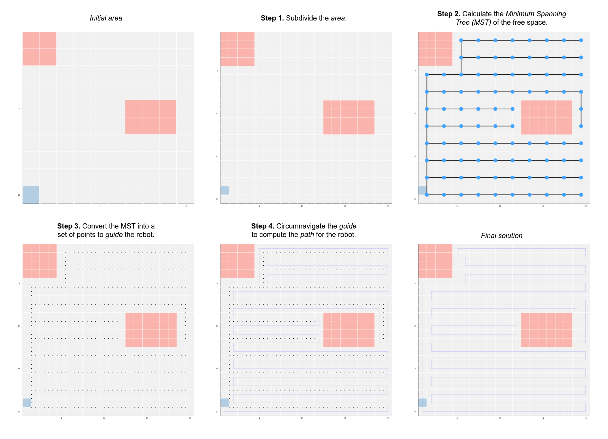
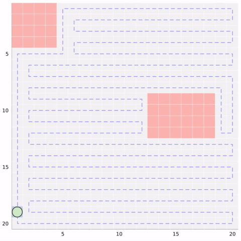
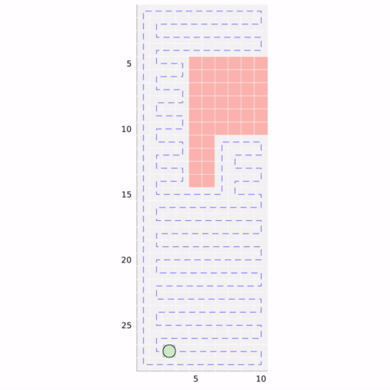
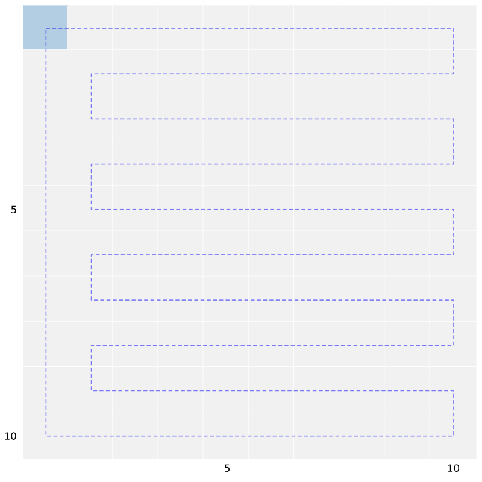
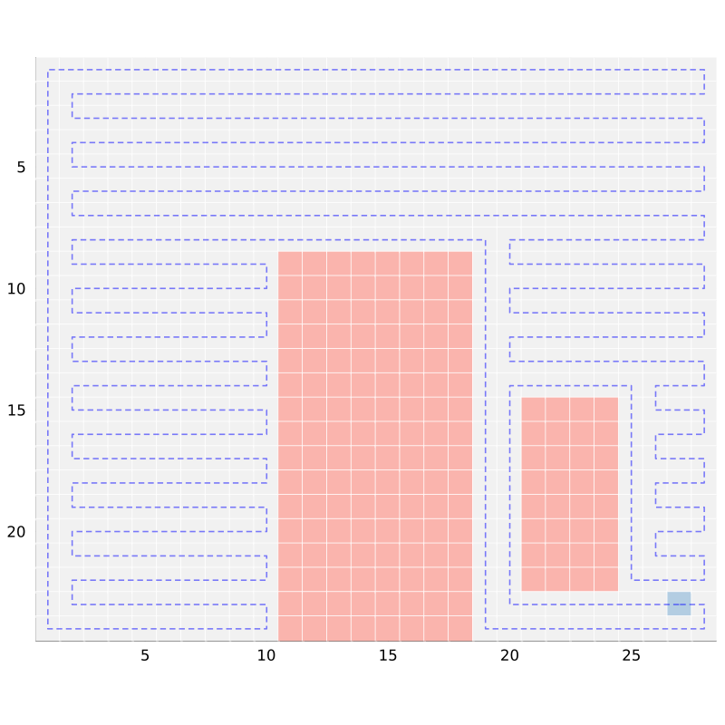
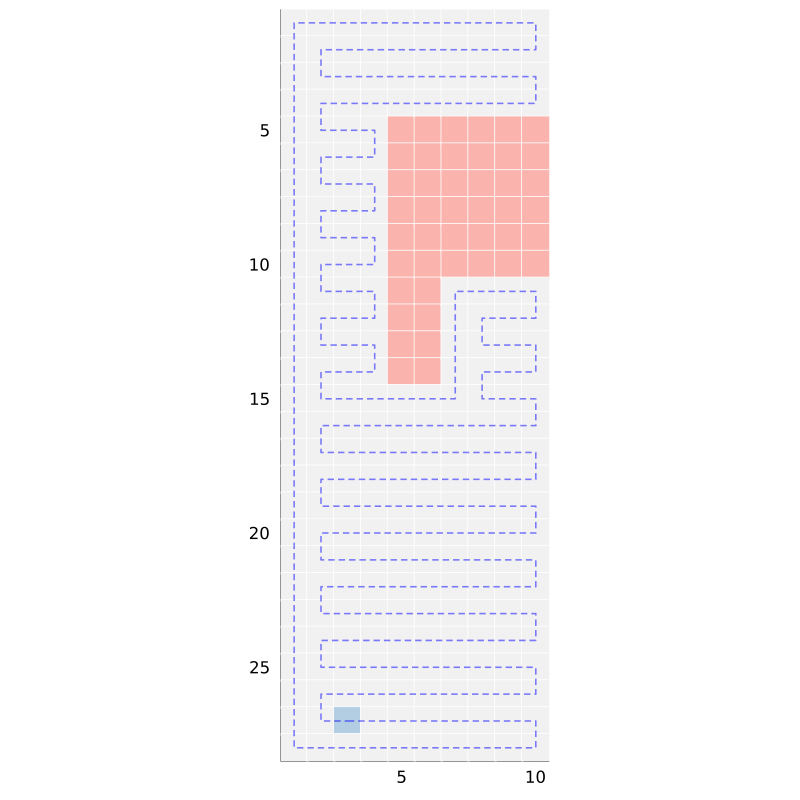
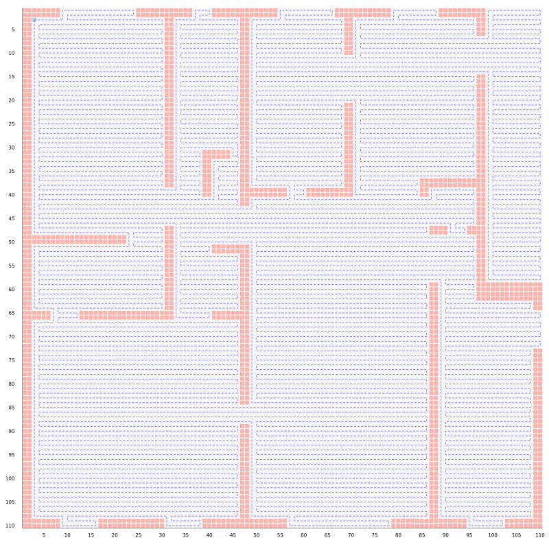
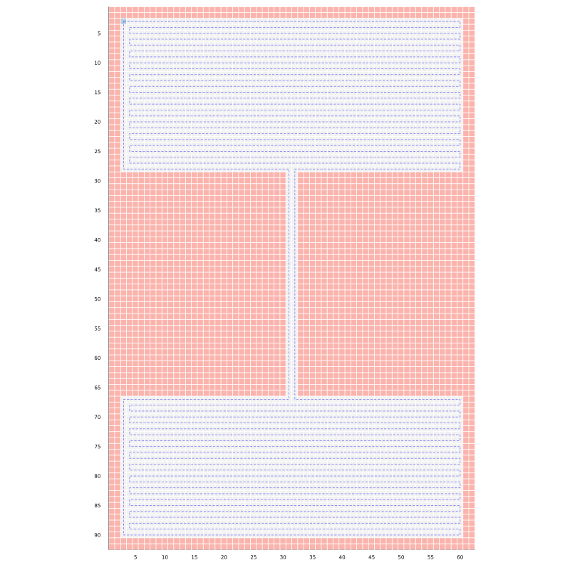
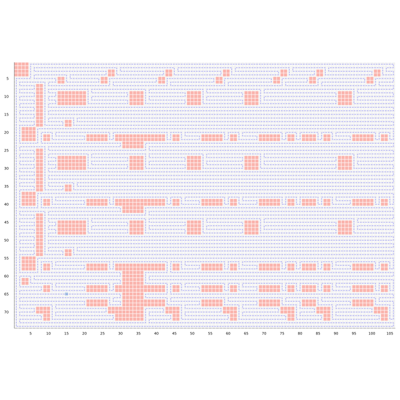
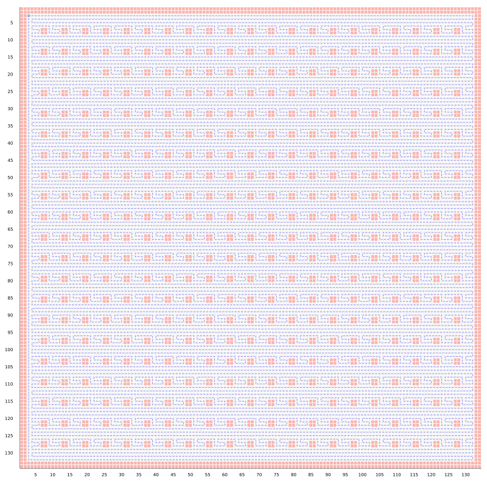

# SpanningTreeCoverage.jl

An optimal O(n) algorithm for single-robot Coverage Path Planning (CPP), implemented in Julia.

## Jupyter notebooks

- [Benchmarks](https://nbviewer.org/urls/gist.githubusercontent.com/ferrolho/2a70e571213e1dcf8094d12f863ed537/raw/59115605bbc4ccd09ed591638c9d5364ed06e46f/benchmarks.ipynb) - Performance benchmarks of the methods in this package.
- [Demo](https://nbviewer.org/urls/gist.githubusercontent.com/ferrolho/2a70e571213e1dcf8094d12f863ed537/raw/59115605bbc4ccd09ed591638c9d5364ed06e46f/demo.ipynb) - Demonstrates the features of this package.

## Step-by-step overview of the method

## Gallery

### Animations

Clicking on one of the animations below should open its MP4 version (hosted on [Gfycat](https://gfycat.com/)).

<table>
  <tr>
    <td align="center"> <a href="./data/map1"><code>map1</code></a></td>
    <td align="center"> <a href="./data/map2"><code>map2</code></a></td>
    <td align="center"> <a href="./data/map3"><code>map3</code></a></td>
  </tr>
</table>

### Images

<table>
  <tr>
    <td align="center"> <a href="./data/empty5x5"><code>empty5x5</code></a></td>
    <td align="center"> <a href="./data/map1"><code>map1</code></a></td>
  </tr>
  <tr>
    <td align="center"> <a href="./data/map2"><code>map2</code></a></td>
    <td align="center"> <a href="./data/map3"><code>map3</code></a></td>
  </tr>
  <tr>
    <td align="center"> <a href="./data/darp"><code>darp</code></a></td>
    <td align="center"> <a href="./data/tunnel"><code>tunnel</code></a></td>
  </tr>
  <tr>
    <td align="center"> <a href="./data/test"><code>test</code></a></td>
    <td align="center"> <a href="./data/pillars"><code>pillars</code></a></td>
  </tr>
</table>

## Similar projects

- DARP: Divide Areas Algorithm for Optimal Multi-Robot Coverage Path Planning
  - [GitHub repository (Java)](https://github.com/athakapo/DARP)
  - [GitHub repository (Python)](https://github.com/alice-st/DARP)
  - [Presentation (slides)](https://slideplayer.com/slide/14776514)
  - [Medium article](https://medium.com/@athanasios.kapoutsis/darp-divide-areas-algorithm-for-optimal-multi-robot-coverage-path-planning-2fed77b990a3)

## References

- Enric Galceran, Marc Carreras. [A survey on coverage path planning for robotics](https://doi.org/10.1016/j.robot.2013.09.004). *Robotics and Autonomous Systems*, 2013.
- Athanasios Kapoutsis, Savvas Chatzichristofis, Elias Kosmatopoulos. [DARP: Divide Areas Algorithm for Optimal Multi-Robot Coverage Path Planning](https://doi.org/10.1007/s10846-016-0461-x). *Journal of Intelligent & Robotic Systems*, 2017.
- Yoav Gabriely, Elon Rimon. [Spanning-tree based coverage of continuous areas by a mobile robot](https://doi.org/10.1023/A:1016610507833). *Annals of Mathematics and Artificial Intelligence*, 2001.
